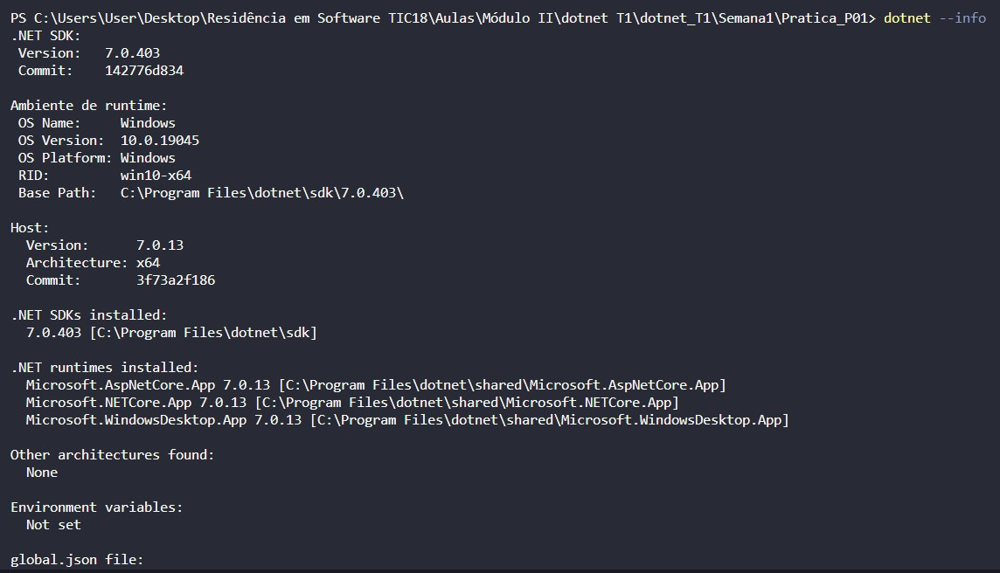
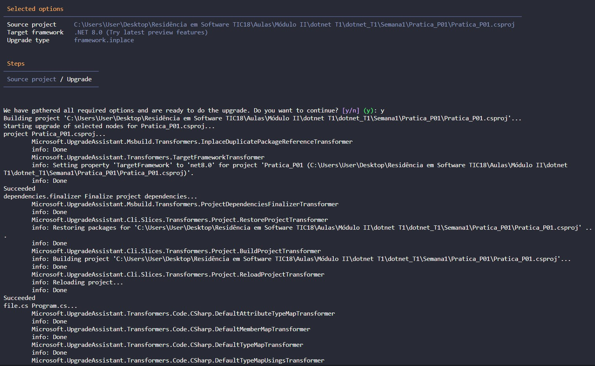

# Prática P01 - C# (.net) 

### Questão 1. Como você pode verificar se o .NET SDK está corretamente instalado em seu sistema? Em um arquivo de texto ou Markdown, liste os comandos que podem ser usados para verificar a(s) versão(ões) do .NET SDK instalada(s), como remover e atualizar.

##### No terminal do VSCode, digitar o comando "dotnet --info" e este deve informar a versão e mais informações. A seguir, exemplo:

##### Já para verificar se há atualizações e fazer update os comando são, respectivamente, "dotnet tool install -g --add-source "https://api.nuget.org/v3/index.json" --ignore-failed-sources upgrade-assistant" e depois "upgrade-assistant upgrade". A seguir, exemplo:

##### Por fim, para remover o SDK o comando é "dotnet-core-uninstall"